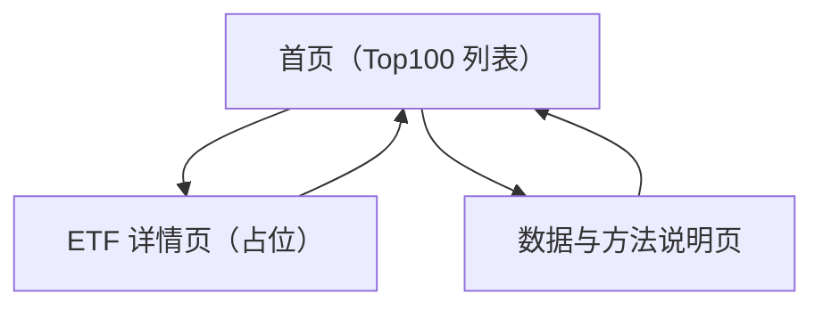

## 1. Product Overview
面向投资者的 ETF 监测网站：在首页展示 Top100 ETF 指标列表，支持筛选与排序，并对 Z 值进行标记。
数据严格遵循“仅完整交易日数据 + 通过 API 获取 + 不杜撰/不补全缺失数据”的约束。

## 2. Core Features

### 2.1 Feature Module
本产品需求由以下核心页面构成：
1. **首页（Top100 列表）**：Top100 ETF 列表、筛选与排序、Z 值标记、数据完整性提示与更新时间说明。
2. **ETF 详情页（占位）**：展示基础信息与指标占位、返回列表。
3. **数据与方法说明页**：说明数据来源、交易日完整性口径、Z 值定义与计算口径、免责声明。

### 2.3 Page Details
| Page Name | Module Name | Feature description |
|---|---|---|
| 首页（Top100 列表） | 顶部导航与入口 | 展示站点名称与主要入口（首页、数据与方法）。 |
| 首页（Top100 列表） | Top100 列表 | 展示 Top100 ETF 的核心字段（如：代码/名称、最新交易日、关键指标、Z 值）；支持分页或虚拟滚动以保证性能。 |
| 首页（Top100 列表） | 筛选 | 按最小必要条件筛选：市场/类别（如有）、代码/名称关键字；筛选条件变化时更新列表结果。 |
| 首页（Top100 列表） | 排序 | 对列表字段进行升/降序排序（至少包含：Z 值、最新交易日、关键指标）；保持与筛选可叠加。 |
| 首页（Top100 列表） | Z 值标记 | 对 Z 值进行视觉标记（如阈值分段：高/中/低），并在表头/帮助提示中解释阈值含义。 |
| 首页（Top100 列表） | 数据完整性与“不可杜撰”约束 | 明确展示“仅完整交易日数据”的状态：缺失则显示“数据不完整/不可用”并从计算/排序中剔除或降权展示；禁止用估算值填补。 |
| 首页（Top100 列表） | 数据获取与刷新提示 | 展示最近一次成功拉取时间、覆盖的最新完整交易日；当 API 获取失败时显示错误态与重试入口（仅重试请求，不生成假数据）。 |
| ETF 详情页（占位） | 基础信息占位 | 展示 ETF 代码/名称等基础信息（来自 API/数据表）；其他模块以占位卡片显示“即将上线/占位”。 |
| ETF 详情页（占位） | 指标占位与回链 | 展示 Z 值/关键指标占位区域；提供返回首页与保留筛选/排序条件的回链。 |
| 数据与方法说明页 | 数据来源与覆盖范围 | 说明数据通过外部行情/基金 API 获取；列出字段口径与更新频率（以“最近成功拉取”为准）。 |
| 数据与方法说明页 | 完整交易日口径 | 说明“完整交易日”判断规则（例如：该交易日目标字段齐全且通过校验）；不满足则该日不参与展示/计算。 |
| 数据与方法说明页 | Z 值定义 | 说明 Z 值的计算公式与使用的历史窗口；明确缺失数据不参与计算，且不进行插值/补齐。 |
| 数据与方法说明页 | 免责声明 | 声明仅供信息参考，不构成投资建议。 |

## 3. Core Process
- 访问首页后，你看到 Top100 ETF 列表与默认排序。
- 你可以输入关键字或选择条件进行筛选，并对 Z 值/关键指标等列进行排序。
- 你点击某一条 ETF 进入详情页，占位展示基础信息并可返回首页（保留你刚才的筛选与排序）。
- 你可进入“数据与方法说明”查看：数据来源、完整交易日规则与 Z 值口径；当数据不完整或 API 失败时，你会在首页看到明确提示，而不是任何“补全/猜测”的数值。

