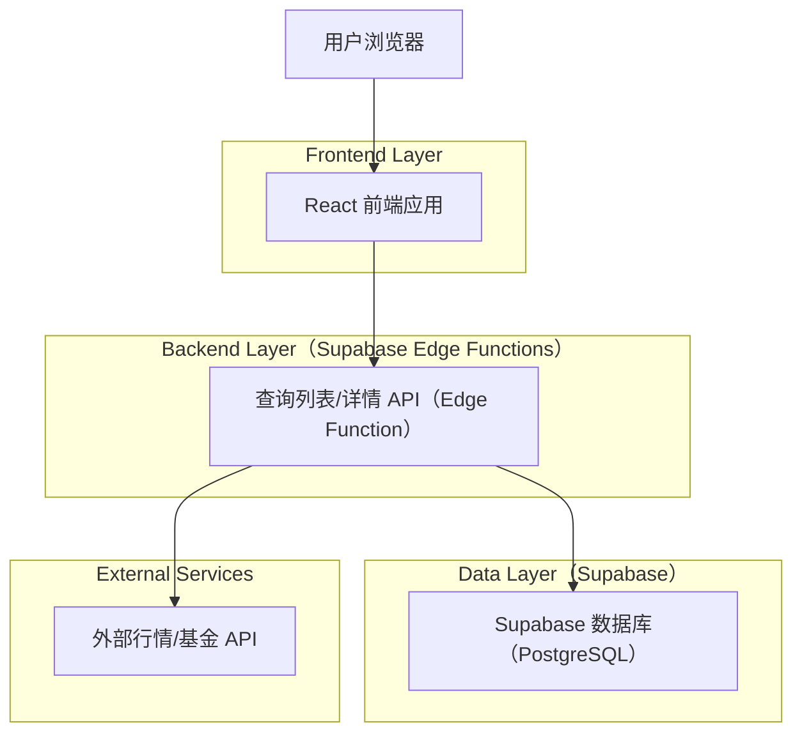
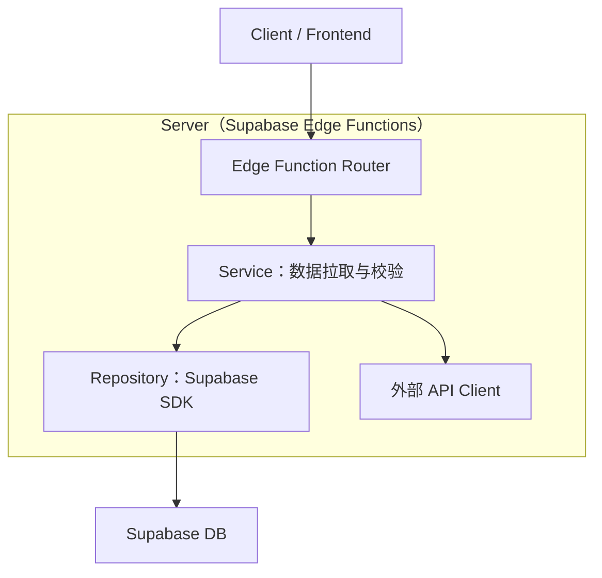
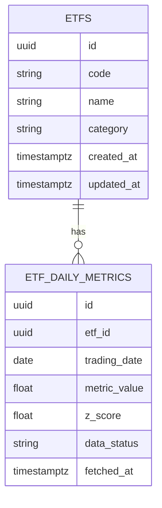

## 1.Architecture design


## 2.Technology Description
- Frontend: React@18 + vite + tailwindcss@3
- Backend: Supabase（Edge Functions + Database）

## 3.Route definitions
| Route | Purpose |
|---|---|
| / | 首页：Top100 列表、筛选排序、Z 值标记、数据完整性与错误提示 |
| /etf/:code | ETF 详情页占位：展示基础信息与预留指标区域 |
| /methodology | 数据与方法说明：数据来源、完整交易日口径、Z 值定义、免责声明 |

## 4.API definitions (If it includes backend services)
### 4.1 Core API
获取 Top100 列表（仅返回“完整交易日可用”的数据）
```
GET /functions/v1/etf-top100?sort=z_desc&keyword=xxx&category=yyy
```
Response（示例类型，字段可按实际 API 口径调整）
```ts
export type EtfTopRow = {
  code: string
  name: string
  latestTradingDate: string // YYYY-MM-DD
  metricValue: number | null
  zScore: number | null
  dataStatus: 'complete' | 'incomplete' | 'api_error'
}
```

获取单只 ETF 详情（占位）
```
GET /functions/v1/etf-detail/:code
```
```ts
export type EtfDetail = {
  code: string
  name: string
  latestTradingDate: string | null
  zScore: number | null
  placeholders: {
    upcomingModules: string[]
  }
}
```

### 4.2 Data integrity rules（关键约束）
- “仅完整交易日数据”：Edge Function 在写入/返回前进行字段齐全校验；不满足则标记为 incomplete，并且不参与 Z 值计算与排行榜排序。
- “API 获取 + 不杜撰”：仅使用外部 API 返回的真实数据；API 失败/缺失时返回错误态或 null，并在前端显式提示，不做插值、回填、猜测。

## 5.Server architecture diagram (If it includes backend services)


## 6.Data model(if applicable)
### 6.1 Data model definition


### 6.2 Data Definition Language
ETFs（etfs）
```
CREATE TABLE etfs (
  id UUID PRIMARY KEY DEFAULT gen_random_uuid(),
  code VARCHAR(32) UNIQUE NOT NULL,
  name VARCHAR(128) NOT NULL,
  category VARCHAR(64),
  created_at TIMESTAMPTZ DEFAULT NOW(),
  updated_at TIMESTAMPTZ DEFAULT NOW()
);
```

ETF 日指标（etf_daily_metrics）
```
CREATE TABLE etf_daily_metrics (
  id UUID PRIMARY KEY DEFAULT gen_random_uuid(),
  etf_id UUID NOT NULL,
  trading_date DATE NOT NULL,
  metric_value DOUBLE PRECISION,
  z_score DOUBLE PRECISION,
  data_status VARCHAR(16) NOT NULL CHECK (data_status IN ('complete','incomplete','api_error')),
  fetched_at TIMESTAMPTZ DEFAULT NOW()
);

CREATE INDEX idx_etf_daily_metrics_etf_id_date ON etf_daily_metrics(etf_id, trading_date DESC);
CREATE INDEX idx_etf_daily_metrics_z ON etf_daily_metrics(z_score DESC);
```

权限建议（最小可用，按需启用 RLS）
```
GRANT SELECT ON etfs TO anon;
GRANT SELECT ON etf_daily_metrics TO anon;
GRANT ALL PRIVILEGES ON etfs TO authenticated;
GRANT ALL PRIVILEGES ON etf_daily_metrics TO authenticated;
```